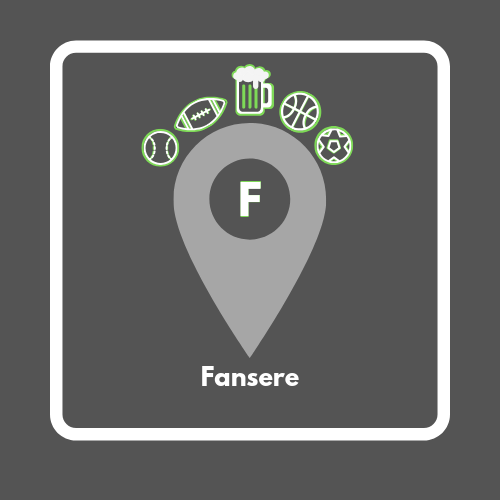

<p align="center">
<a href="https://www.fansere.com/"></a>
</p>

# Fansere - Sports Meetup App

(https://www.youtube.com/watch?v=LgvtEnydU1A&feature=youtu.be)

## Table of Contents

- [Installation](#installation)
- [About](#about)
- [Style](#style)
- [Planning](#planning)
- [Technologies](#technologies)

### Installation

Step One: clone this repo to your local machine  
Step Two: npm install  
Step Three: cd into ios, pod repo update, pod install  
Step Four: npm start OR react-native start  
Step Five: react-native run-android OR react-native run-ios  

### About

Full Stack Sports App for Client  
Fellow fans at your fingertip. A premier mobile application to find sports fans of your favorite teams, wherever you are. Fansere gives you home field advantage with a click of a button. Fansere provides you the opportunity to match with other fans of your favorite teams, pinpoint game-watching locations, and once connected with fellow fans, reach out via in-app chat to plan where to watch the game.

### Style

[Color Scheme]
```
/* RGB */
$color1: #ffffff; // font
$color2: #000000; // main background
$color3: #7ed957; // accent color
$color4: #a6a6a6; // alt background
$color5: #f4f4f4; // accent color
$color6: #545454; // alt background
```

### Planning

(https://trello.com/b/DvXU9dNo/capstone)

*Plan for User*
-User logs in (OAuth/Bcrypt).
-Nav bar has map, profile and feed.
-Directed to profile page. On your profile page, you have access to your profile details which consist of username, profile pic, location, roster, favorite teams, tagline, and total check-ins. All information is editable except for check-ins.
-Map shows bar locations in area.
-Roster shows friends and ability to eventually have 1 on 1 chat.
-Location drop down, input list (Denver, Chicago, New York)
-Feed is contingent on location selected. Organized by sport and then team with filter options. Feed shows events. Events have options of attending or not (check-in feature/can only check-in to 3 events at a time) along with commenting. Users have ability to click on individual users to add to roster. 14 day cycle of expiration.
-Events display username, event date, bar location, image of team.

*Plan for Bar*
-Bar logs in.
-Nav bar has map, profile, and feed.
-Bar's profile consists of bar info, location, specials, tagline (own event page potentially).
-Bar's have access to feed and can create unique posts with daily specials for only Fansere users and see who's all attending their location.


### Technologies

ReactNative, NativeBase, ReactNative Elements, ReactNative Navigation, ReactNative Maps, Google Maps API, Cloud Firestore Firebase, OAuth, CocoaPods, Node, Android Studio, Xcode, JavaScript, JSX, HTML, CSS

<a href="https://www.firebase.com/"></a>
<a href="https://facebook.github.io/react-native/"></a>
<a href="https://www.javascript.com/"></a>
<a href="https://nodejs.org/en/"></a>
<a href="https://npmjs.com"></a>
<a href="https://www.android.com/"></a>
<a href="https://www.apple.com/"></a>
<a href="https://html.com/"></a>
<a href="https://css-tricks.com/"></a>
